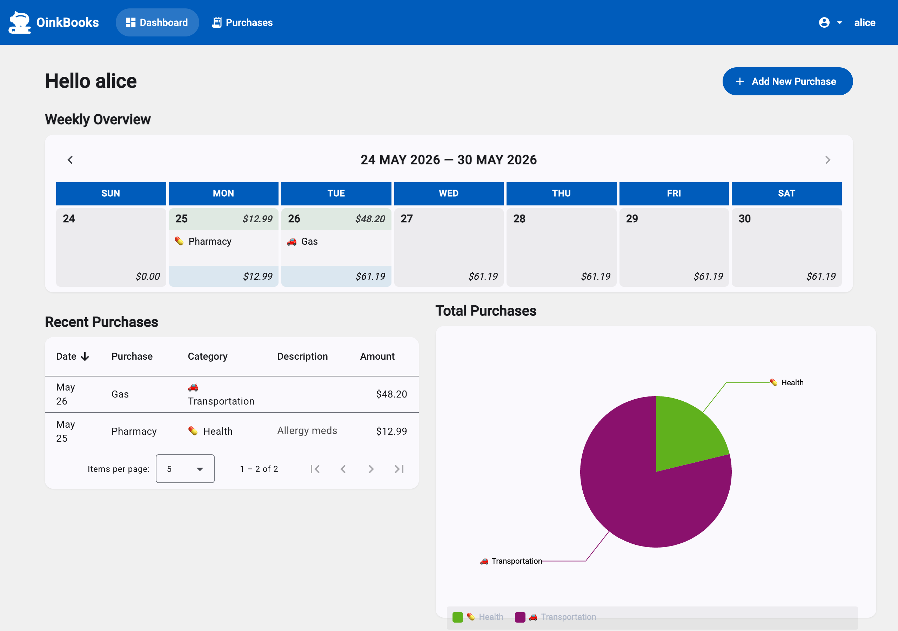
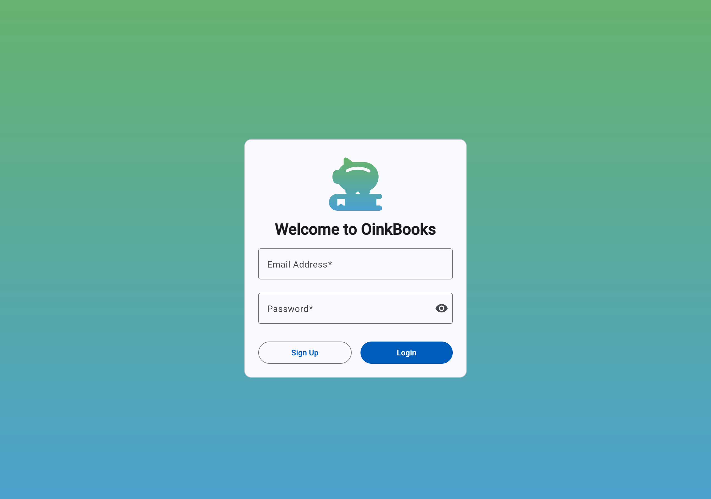
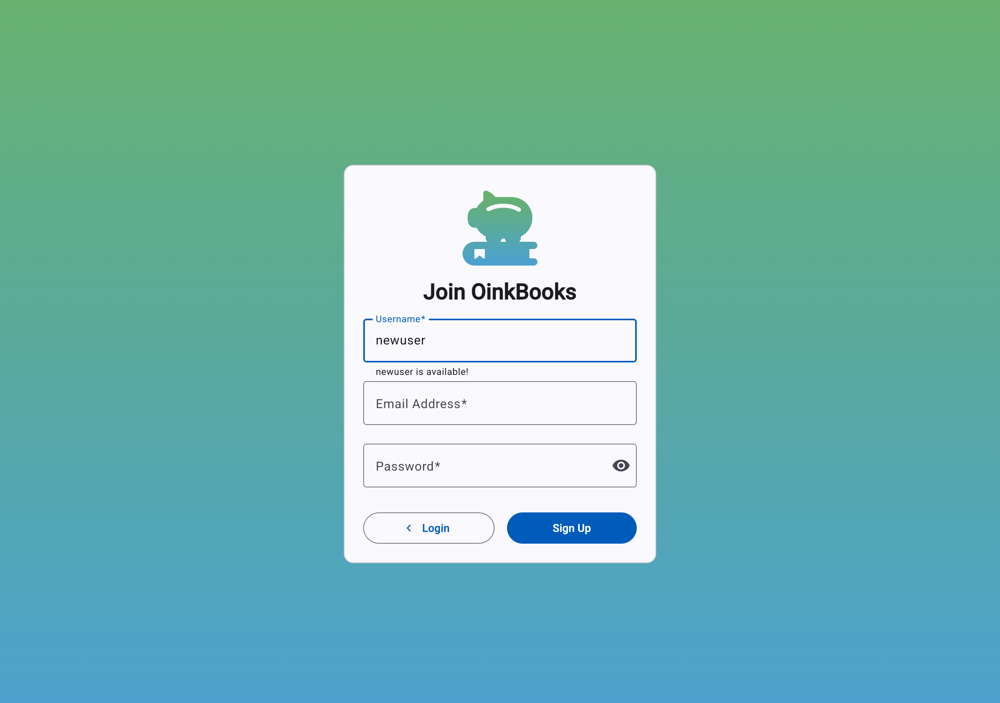
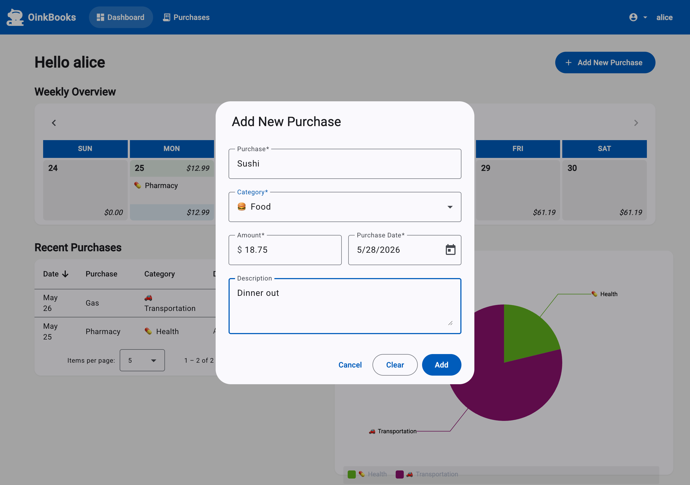
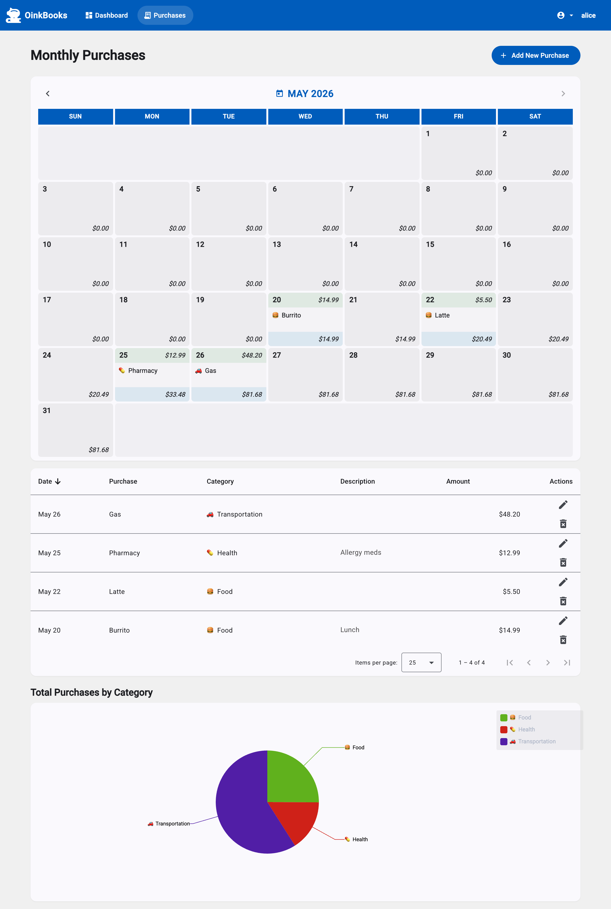

# OinkBooks v2 🐷

A personal purchase tracker — visualise and track expenses on a calendar, table, and pie chart.

**v2** is a ground-up rebuild of the [v1 React app](https://github.com/jrlnd/project-oinkbooks/tree/v1) (Next.js 12 + Firebase + Material UI) onto a modern Angular stack, ported incrementally over nine feature slices. Same app, different end of the JS ecosystem.

## Live

| Piece | URL |
| --- | --- |
| **Web (Angular)** | https://project-oinkbooks-v2.vercel.app |
| **API (NestJS)** | https://oinkbooks-api.onrender.com |

> Render's free tier sleeps the API after ~15 min idle — the first request after a cold start takes ~30–60 seconds while the container wakes. After that it's instant.



## Stack

| Layer | v1 (original) | v2 (this repo) |
| --- | --- | --- |
| **Frontend** | Next.js 12 + React 17 + MUI | **Angular 21** (standalone, **zoneless**) + Angular Material |
| **Reactivity** | hooks (`useState` / `useEffect`) | **signals + RxJS** (`signal` / `computed` / `effect` / `toSignal`) |
| **Backend** | Firebase (BaaS) | **NestJS 11** REST API |
| **Auth** | Firebase Auth | **JWT + bcrypt** (Passport, owned in-house) |
| **Database** | Firestore | **Postgres** + Drizzle ORM |
| **Charts** | Recharts | ngx-charts |
| **Forms** | react-hook-form | Angular Reactive Forms |
| **Unit tests** | — | **Vitest** + `@analogjs/vitest-angular`; **Jest** for the API |
| **E2E tests** | — | **Playwright** |
| **Hosting** | Vercel (single app) | **Vercel** (web) · **Render** (API) · **Neon** (Postgres) |

## Features

- Email/password registration + login (JWT, owned auth, never stores plaintext passwords)
- Weekly calendar dashboard with cumulative running totals
- Monthly calendar + paginated transactions table with edit/delete
- Pie chart with a dynamically-generated rainbow palette per number of categories
- Add/edit purchase via a reactive-form dialog (validated client-side and server-side from a single shared DTO contract)
- Per-user data isolation enforced at every API endpoint; cross-user mutations return 404 to avoid existence leaks
- Responsive (mobile agenda view collapses the calendar to only days with purchases)
- 23 automated tests (Vitest + Jest + Playwright)

## Architecture

```
                                  ┌─ Vercel ──────────────────────┐
   browser  ──HTTPS──►            │  Angular 21 SPA (zoneless)    │
                                  │  Material 3 · RxJS · signals  │
                                  └──────────────┬────────────────┘
                                                 │
                                          JWT in Authorization header
                                                 │
                                  ┌─ Render ─────▼────────────────┐
                                  │  NestJS 11 (Drizzle, JWT)     │
                                  │  CORS scoped to Vercel origin │
                                  └──────────────┬────────────────┘
                                                 │
                                  ┌─ Neon ───────▼────────────────┐
                                  │  Postgres (pgBouncer pooler)  │
                                  │  users · categories · purchases │
                                  └───────────────────────────────┘
```

The frontend and backend share a single **`@oinkbooks/types`** package via the pnpm workspace — `PurchaseDetails`, `CategoryDetails`, and every DTO are imported by both sides, so the API contract cannot drift.

## Repo layout (pnpm-workspace monorepo)

```
oinkbooks/
├─ apps/
│  ├─ web/                Angular 21 frontend
│  │  ├─ src/app/core/    auth, http interceptor, route guards, data services
│  │  ├─ src/app/features/ shell · login · register · dashboard · purchases
│  │  │                   calendar · purchase-table · category-chart · purchase-dialog
│  │  ├─ e2e/             Playwright tests
│  │  ├─ playwright.config.ts
│  │  └─ vitest.config.ts
│  └─ api/                NestJS backend
│     ├─ src/auth/        JWT strategy, guard, bcrypt service, DTOs
│     ├─ src/purchases/   CRUD scoped by @CurrentUser
│     ├─ src/categories/  read-only list (default 7 seeded per-user at register)
│     ├─ src/db/          Drizzle schema, migrations, DbModule (Global)
│     └─ drizzle/         generated SQL migrations
├─ packages/types/        shared interfaces + DTO contracts (consumed by web AND api)
├─ docker-compose.yml     local Postgres 16
├─ vercel.json            web build + SPA rewrite
├─ render.yaml            API Blueprint (build runs drizzle-kit migrate)
└─ DEPLOY.md              step-by-step deploy guide
```

## Run locally

Prereqs: Node 22, Docker, pnpm 10.

```bash
pnpm install
cp .env.example .env       # default DATABASE_URL points at local Docker
pnpm db:up                 # Postgres 16 in Docker
pnpm db:migrate            # apply Drizzle migrations
pnpm dev                   # runs web (:4200) + api (:3000) together
```

Open http://localhost:4200, click **Sign Up**, create an account — registration seeds the 7 default categories transactionally, so you can start adding purchases immediately.

Other useful commands:

```bash
pnpm dev:web         # Angular only        → http://localhost:4200
pnpm dev:api         # NestJS only         → http://localhost:3000
pnpm db:studio       # Drizzle Studio GUI  → https://local.drizzle.studio
pnpm build           # production-build everything
```

## Tests

```bash
pnpm test            # Jest (api) + Vitest (web)  — 19 unit tests
pnpm test:e2e        # Playwright                 — 4 E2E flows
```

- **API:** Jest + ts-jest; service unit tests stub the Drizzle client via the `DRIZZLE` injection token (e.g. `auth.service.spec.ts` asserts register hashes the password and seeds categories in a transaction)
- **Web unit:** Vitest + `@analogjs/vitest-angular` (TestBed in jsdom); covers the rainbow colour utility, the categories service helpers, and the Login component's reactive-form validators
- **E2E:** Playwright (system Chrome via `channel: 'chrome'`); the config's `webServer[]` auto-starts both api + web with `reuseExistingServer: true` so local dev keeps working

## Deployment

See [DEPLOY.md](./DEPLOY.md) for the step-by-step (Neon → Render → Vercel). Highlights:

- **Vercel**: monorepo root, `vercel.json` drives `pnpm install` + `pnpm --filter @oinkbooks/web build`, output `apps/web/dist/web/browser`, SPA rewrite all paths → `/index.html`
- **Render**: free Web Service from `render.yaml`; build runs `drizzle-kit migrate` (free tier has no `preDeployCommand`); `/health` health-check path
- **Neon**: pooled connection string only (host contains `-pooler`); `prepare: false` in `db.module.ts` so postgres.js works through Neon's pgBouncer

## React → Angular notes

The interesting half of the project. Every v1 idiom has a v2 counterpart:

| v1 (React) | v2 (Angular) | Why |
| --- | --- | --- |
| `useState(x)` | `signal(x)` | Owned local state |
| `useMemo(() => …, deps)` | `computed(() => …)` | Derived state, auto-tracked |
| `useEffect(() => fx, deps)` | `effect(() => fx)` | Side effects on signal change |
| props (`<Cmp x=…/>`) | `input()` / `input.required()` / `model()` | Data flowing down |
| callback prop (`setCalDate`) | `output<T>()` | Events flowing up |
| `useContext(UserCtx)` | `@Injectable({providedIn:'root'})` | App-wide shared state |
| `<PrivateRoute>` | `CanActivate` route guard | Pre-navigation auth check |
| Firestore `onSnapshot` | RxJS `combineLatest` → `switchMap` → `shareReplay` | Async data stream |
| react-hook-form `Controller` | Reactive Forms (`FormBuilder.nonNullable.group`) | Strict-typed forms |
| `useMediaQuery` | CDK `BreakpointObserver` + `toSignal` | Responsive logic |
| react-hot-toast | `MatSnackBar` | Notifications |
| MUI Dialog | `MatDialog` (data IN via `MAT_DIALOG_DATA`, result OUT via `dialogRef.close()`) | Modal pattern |

The **single biggest mental shift** is the data layer: v1 used per-page `onSnapshot` listeners; v2 has one shared RxJS stream in `PurchasesService` that the calendar, table, and chart all consume. A mutation calls `tap(() => refresh$.next())`, and every consumer updates from one HTTP call.

## Screenshots

| | |
| --- | --- |
|  |  |
| Login (gradient brand background, validated form) | Register (live RxJS username availability check) |
|  |  |
| Dashboard (weekly calendar + recent purchases + chart) | Add Purchase dialog (Reactive Forms inside `MatDialog`) |



*Monthly Purchases page — full month grid with cumulative totals, editable table, and pie chart.*
